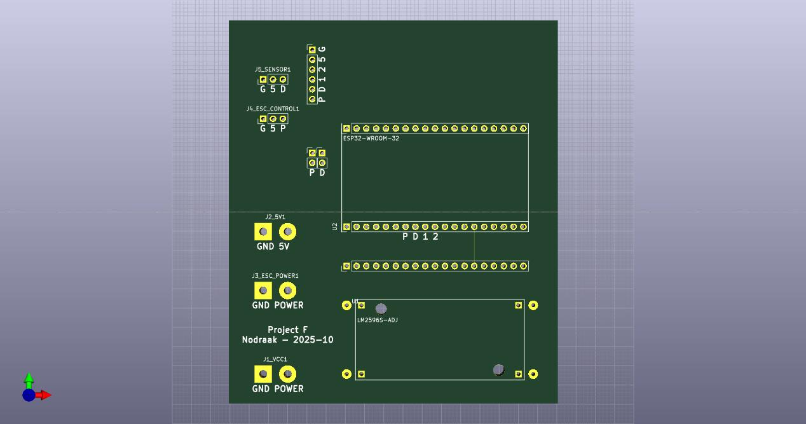
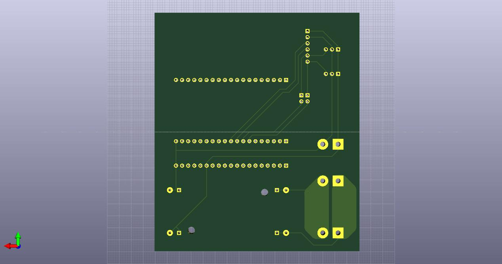

# Electrical

## Introduction

*A small PCB to connect all the components cleanly, 80x100 mm.*

 

The following components will be used:

* Electric motor + ESC: Power (12V), PWM
* Light sensor: Power, signal
* ESP32 (5V)
* Step down 12V to 5V

## Notes

### MCU

* ESP32 WROOM 32
* AZ Delivery ESP32 DevKitC v4

### KY-018

LDR-resistor (Light dependent resistor), which decreases its resistance at brighter surrounding

Pinout:
* GND
* V+ (5V)
* Signal

```c
int rawValue = analogRead(sensorPin);
float voltage_v = rawValue * (5.0 / 1023);
float resistance = 10 * voltage_v / ( 5.0 - voltage_v);
```

### ESC

Power rating:

* Max 150 W -> @12 V = 12 A
* Max 13 A for 60 sec

PWM control:

50 Hz PWM (20 ms): 20 ms low + 1-2 ms active


### PSU

* Wall mounted: 12 V * 2 A = 24 W
* Lab: 30 V * 10 A = 300 W
