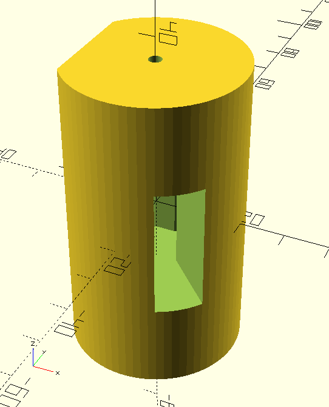
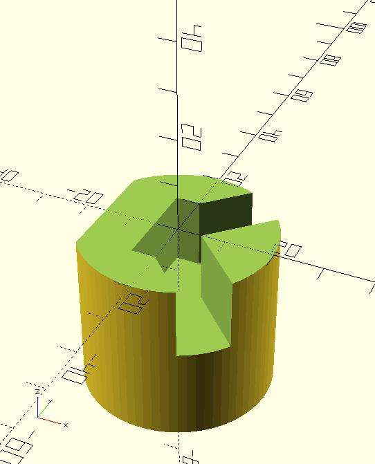

# Mirror Holder

## Introduction

*Piece to hold the mirror and mount it on the motor, 70x40 mm.*

 

The holder will rotate quickly (10-100 RPM).
Therefore, the mirror must be well secured so that it does not fly away.
The best is to take advantage of the centrifugal force to keep it in place.
This leads to an unbalanced piece, which must then be carefully balanced with a notch of a very specific depth.
To help with balancing, the piece is as full as possible, and only a small path for the laser is carved through.

## Initial design with ChapGPT

An initial design was done with ChapGPT to quickly get started with a rough shape and to work around OpenScad's syntax which I'm not familiar with.

Prompt:

```
Write an openscad script code:

* Main: Create a main, vertical cylinder d=30 mm, h=60 mm
* Motor holes: Subtract at each end (top and bottom), a cylinder d=3 mm, h=15 mm
* Mirror: Subtract at the middle, a rectangles LxD=10x20 mm and h=30 mm
* Laser path:
    * Subtract two horizontal rectangles
        * W=sqrt(5**2+5**2) mm, L=20 mm
        * Each oriented +/- 45 deg horizontally compared to the previous middle rectangle
        * One end of the rectangle should be on the center of the main cylinder, the other end should go towards the outside
    * Subtract similar rectangles
        * But with the end +/- 5 mm horizontally from the center of the main cylinder
* Rear balancing: Subtract a rectangle H=60 mm, W=30 mm
    * Similar to the "Laser path" subtractions, but on the other side (horizontally)
    * Its center should be W/2+10 mm from the center of the Main cylinder

A few requests:

* Write only the code and nothing else.
* Do not add comments for obvious things, but do add a comment for each step above.
* Use variables as needed for constants.
* Add "$fn = 60;" at the top.
```

## 3D printing

* OpenScad
    * Render
    * Export as STL
* Ultimaker Cura
    * Layer height: 0.2 mm
    * Density: 40% (TBD: 30-50%?)
    * Pattern: Tri Hexagon (TBD: Cubic, Tri-Hexagonal, Grid, Triangle?)
    * Speed: 50 mm/sec
    * -> Print time: 4.5h (first PoC: 1.5h)
